# Leetcode Code Practice

Using language **C++** and questions from **LeetCode**

## [随想录](https://programmercarl.com/)

### 1.1 二分查找
[binary-search](https://leetcode.cn/problems/binary-search/)

   **提示：**
   + 你可以假设 `nums` 中的所有元素是不重复的。
   + n 将在 `[1, 10000]` 之间。
   + `nums` 的每个元素都将在 `[-9999, 9999]` 之间。
   
   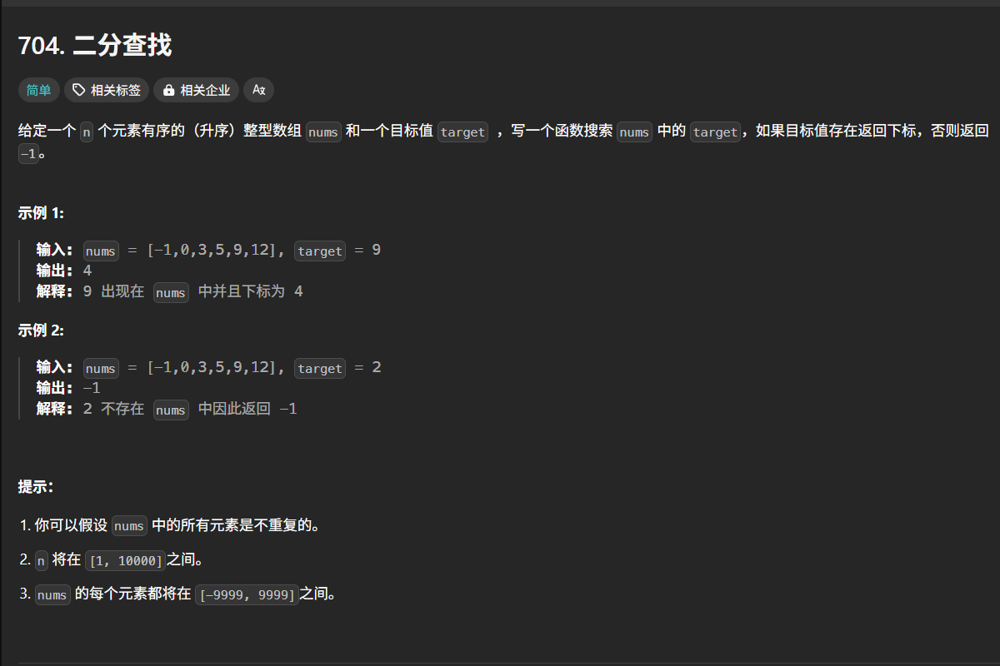

### 1.2 移除元素
[remove-element](https://leetcode.cn/problems/remove-element/)

   **提示：**
   + `0 <= nums.length <= 100`
   + `0 <= nums[i] <= 50`
   + `0 <= val <= 100`
   
   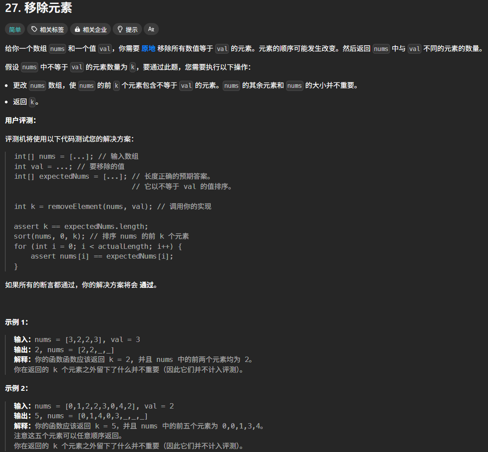

### 1.3 有序数组的平方
[squares-of-a-sorted-array](https://leetcode.cn/problems/squares-of-a-sorted-array/)

   **提示：**
   +  `1 <= nums.length <= 10^4`
   + `-104 <= nums[i] <= 10^4`
   + `nums` 已按 **非递减顺序** 排序
   
   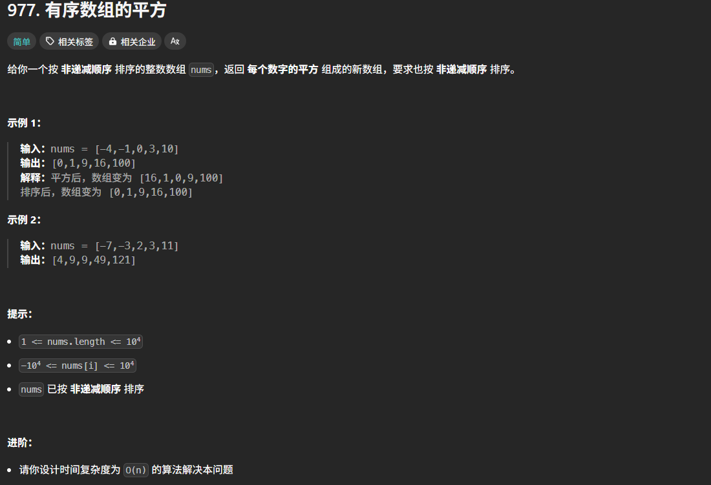

### 1.4 长度最小的子数组
[minimum-size-subarray-sum](https://leetcode.cn/problems/minimum-size-subarray-sum/)

   **提示：**
   + `1 <= target <= 10^9`
   + `1 <= nums.length <= 10^5`
   + `1 <= nums[i] <= 10^4`

   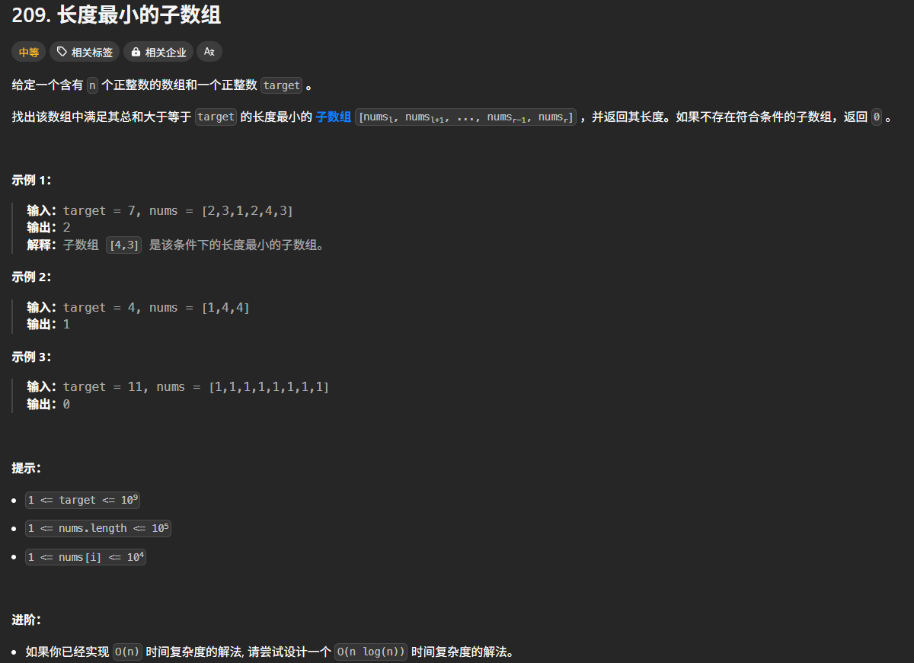

### 1.5 螺旋矩阵II
   [spiral-matrix-ii](https://leetcode.cn/problems/spiral-matrix-ii/)

   **提示：**
   + `1 <= n <= 20`
   
   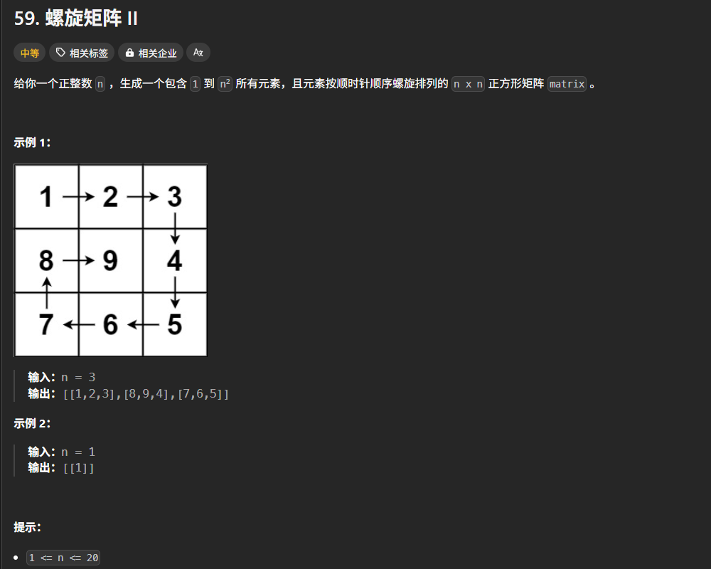

### 2.1 移除链表元素
   [remove-linked-list-elements](https://leetcode.cn/problems/remove-linked-list-elements/)

   **提示：**
   + 列表中的节点数目在范围 `[0, 10^4]` 内
   + `1 <= Node.val <= 50`
   + `0 <= val <= 50`

   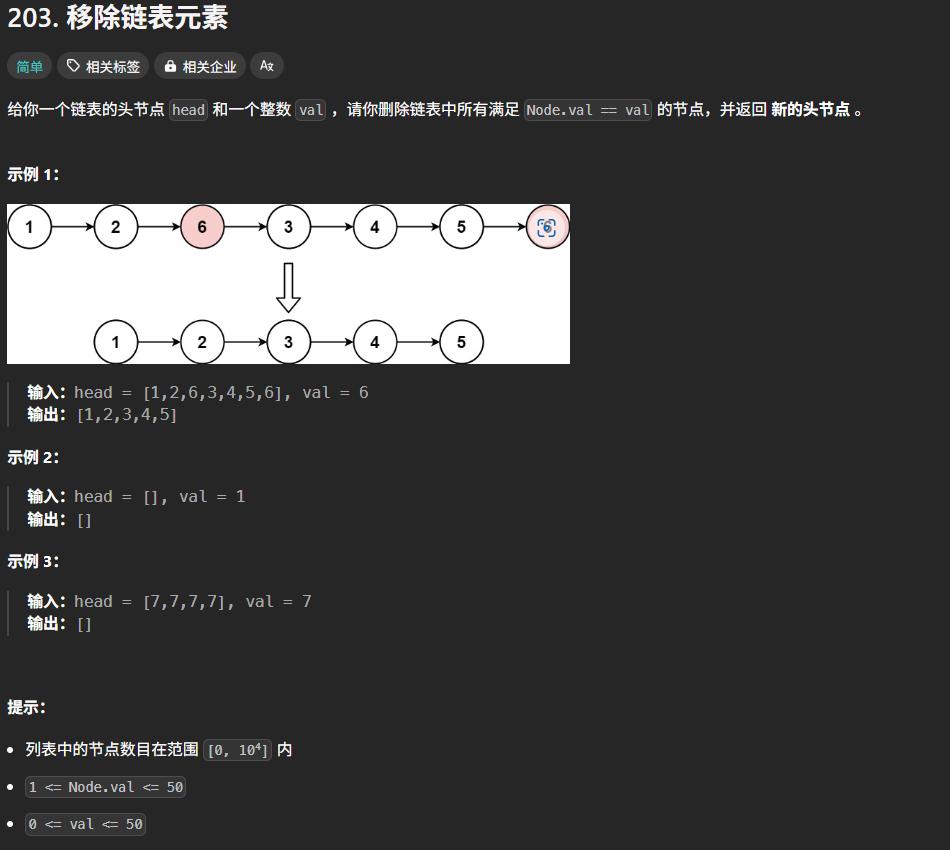

7. title
   

   **提示：**

   

8. title
   

   **提示：**

   

9. title
   

   **提示：**

   

10. title
    

**提示：**

## [LeetCode 75](https://leetcode.cn/studyplan/leetcode-75/)

### 1. 交替合并字符串
[merge-strings-alternately](https://leetcode.cn/problems/merge-strings-alternately/description/?envType=study-plan-v2&envId=leetcode-75)

   **提示：** Use two pointers, one pointer for each string. Alternately choose the character from each pointer, and move the pointer upwards.
   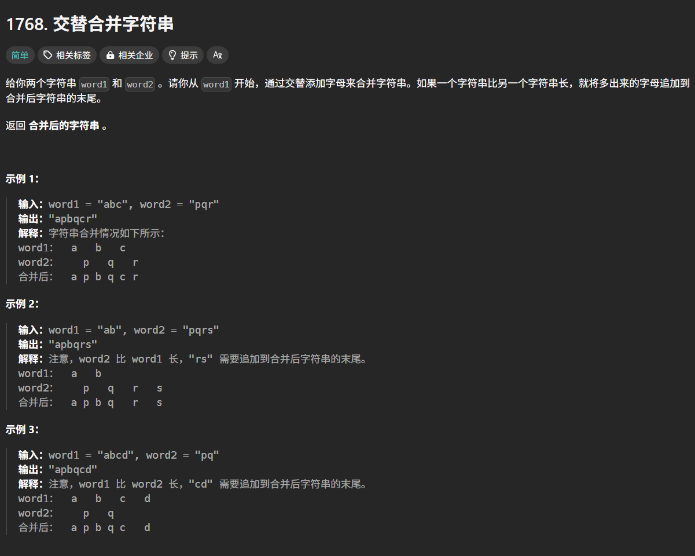

### 2. 字符串的最大公因子
[greatest-common-divisor-of-strings](https://leetcode.cn/problems/greatest-common-divisor-of-strings/description/?envType=study-plan-v2&envId=leetcode-75)
   
   **提示：** The greatest common divisor must be a prefix of each string, so we can try all prefixes.
   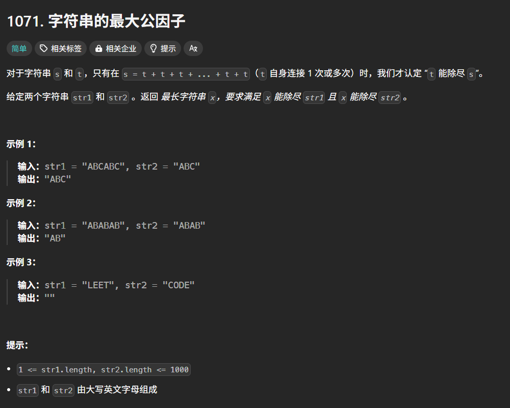

### 3. 拥有最多糖果的孩子
[kids-with-the-greatest-number-of-candies](https://leetcode.cn/problems/kids-with-the-greatest-number-of-candies/description/?envType=study-plan-v2&envId=leetcode-75)
   
   **提示：** For each kid check if candies[i] + extraCandies ≥ maximum in Candies[i].
   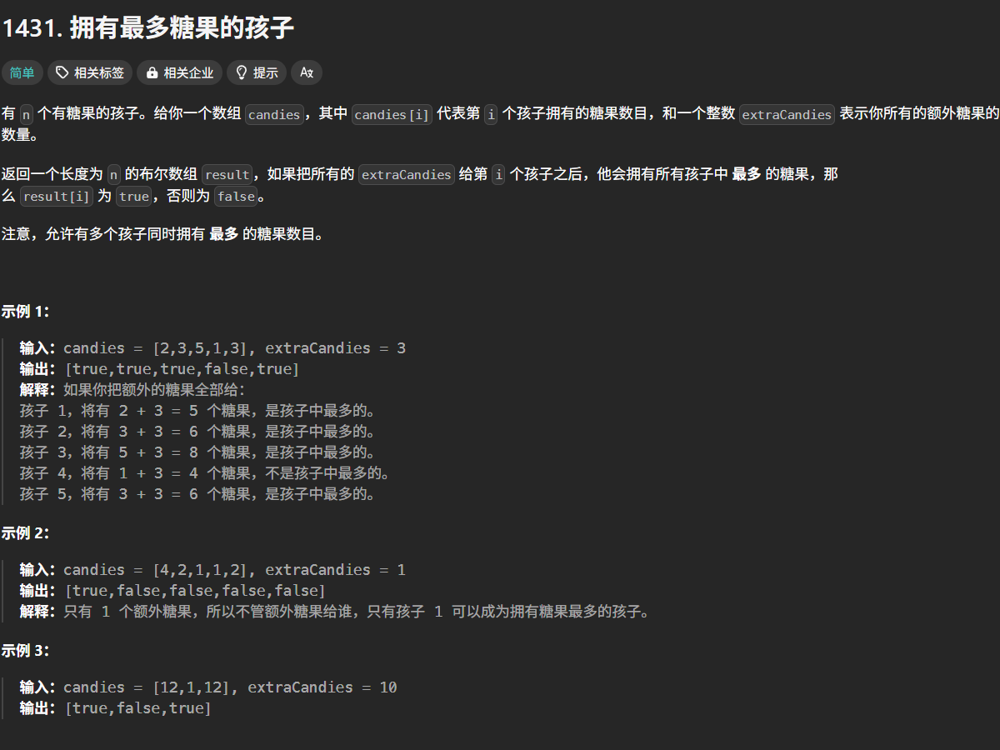

### 4. 种花问题
[can-place-flowers](https://leetcode.cn/problems/can-place-flowers/description/?envType=study-plan-v2&envId=leetcode-75)
   
   **提示：** 
   + `1 <= flowerbed.length <= 2 * 10^4`
   + `flowerbed[i]` 为 `0` 或 `1`
   + `flowerbed` 中不存在相邻的两朵花
   +  `0 <= n <= flowerbed.length`

   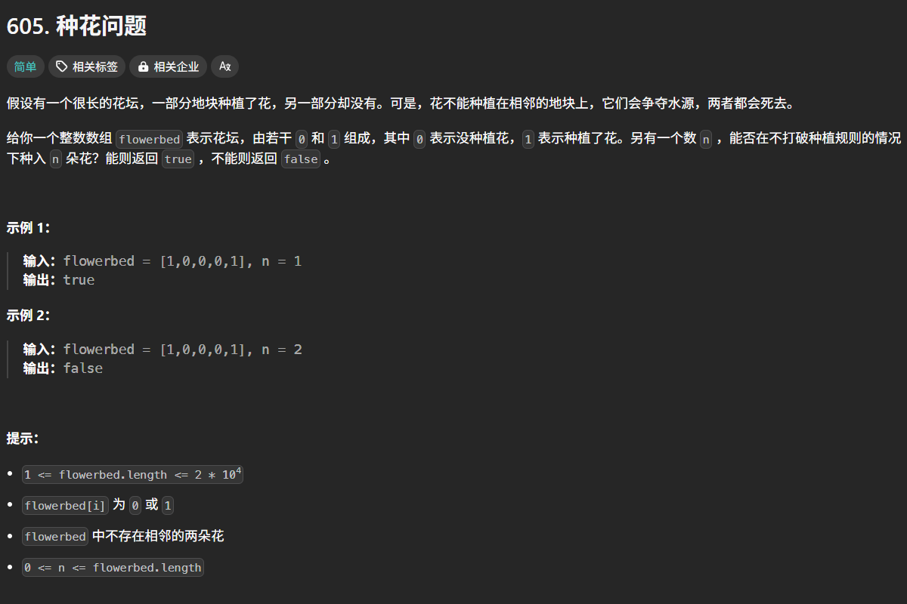

### 5. 反转字符串中的元音字母
[reverse-vowels-of-a-string](https://leetcode.cn/problems/reverse-vowels-of-a-string/description/?envType=study-plan-v2&envId=leetcode-75)
   
   **提示：**
   + `1 <= s.length <= 3 * 10^5`
   + `s` 由 可打印的 **ASCII** 字符组成
   
   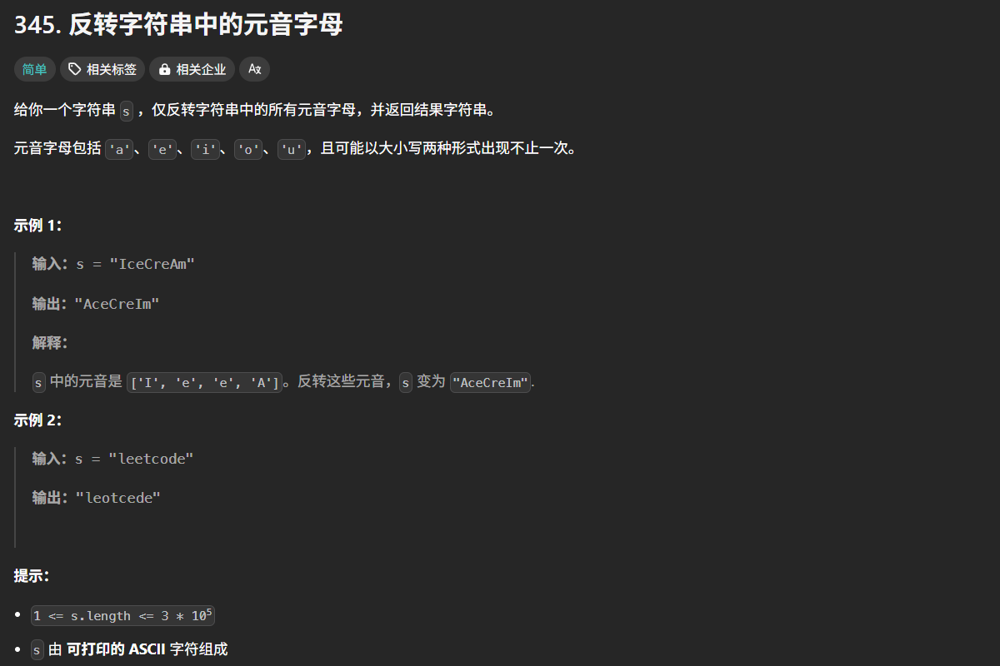

6. TODO

7. TODO

